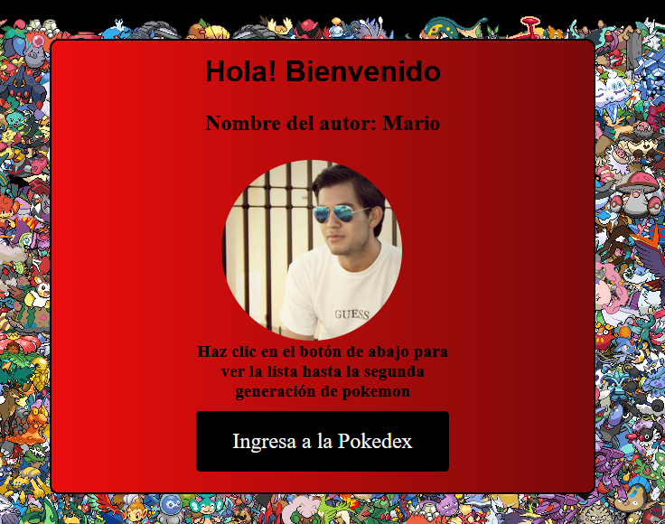
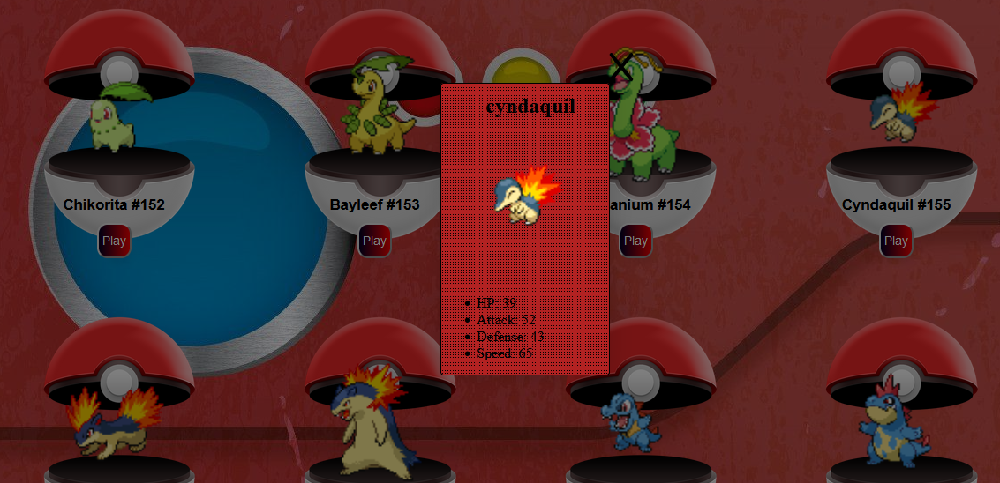
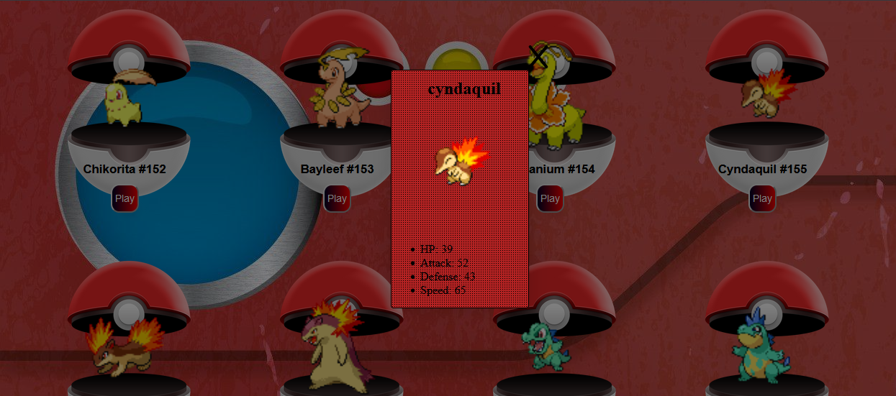

# Proyecto Frontend Pokedex

## :astonished: De que trata?

### Este proyecto es una página web interactiva en donde se puede consultar la información relacionada de los pokemones de la segunda generación. Para la realización del mismo, se utilizará la libreria React y otras nuevas adiciones.

## :wrench: :hammer: Funcionalidades y características añadidas

1. ### Agregar un prealoader personalizado (pokebola girando) que aparecera mientras se carga el contenido de la página.

2. ### Agregar una página de inicio que contiene la información principal e instrucciones para acceder a la página que dirige a la parte interactiva.

3. ### Implementar distintas funcionalidades en la parte interactiva para que el usuario pueda solicitar, y buscar la información de cada pokemon.

4. ### Se modifico la pokeapi para que los pokemon aparezcan en su version shiny(color alternativo en videojuegos)

5. ### Entre las funcionalidades más destacables se agregó un buscador, un botón para borrar los datos, ventanas modales que muestran las estadisticas y un botón que al hacerle click permite escuchar el sonido correspondiente de cada pokemon(versiones de videojuegos GBA y NDS).

6. ### Se agregarón links que dirigen a los sitios web oficiales que sirvieron para la utilización de este proyecto así como su aviso de privacidad.

## :sparkles: Nota importante

### Para la organización de los archivos CSS, se crearón directorios y subdirectorios correspondientes a cada elemento padre junto a sus elementos hijos para ubicarlos con más facilidad.

### En las imágenes del proyecto se mostrará el color normal de los pokemon, también el color alternativo(implementado en este proyecto), para que el usuario pueda ver la comparativa de estos colores.

---

## :iphone: Resoluciones Dispositivos

### Este proyecto se adapta a pantallas que van desde 320px hasta 1280px

## :stars: Imágenes del resultado final

## Link de mi página:

###

## Tecnologías utilizadas:

&nbsp;
&nbsp;
&nbsp;
&nbsp;
